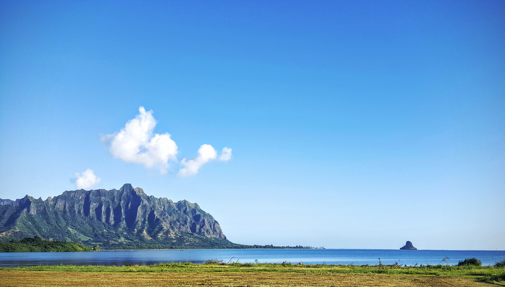

**Rode just too damn far...**

===

Yes! Okay, I can't say I had a journey like I'd call "There and Back Again." No rings, no dragons, no trolls. But it was a fabulous ride.

The weather was perfect when I left the house just after 5:00 am this morning. I'd chosen to ride my Quickbeam, thinking a singlespeed would be just the thing. It was.

The sun wouldn't rise for some time, the air was cool and I was off.

more in a bit...

Back...after a few more miles on my regular Monday routine...no not biking, though I do use mine to get to and from what I'm doing, hence a few more miles.

All in all I rode 87 miles today. Not bad.

I'm beat though (mostly because it was a really long day), so that's it for tonight.

Ciao!
