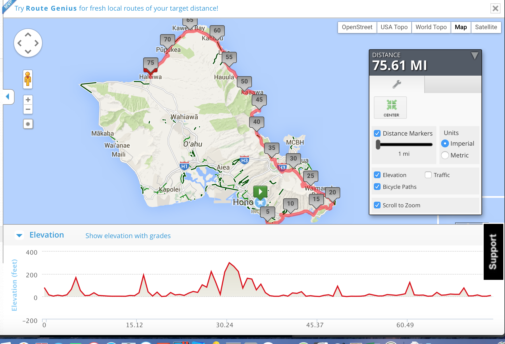

**Riding just too damn far...**

===

One of my favorite rides is from Honolulu to Haleiwa around the island, not over it. I've done it several times and yes, plan on doing it tomorrow weather permitting.

I may add a twist though.

I may try to ride back as well. Hence, "too damn far."

Here's a copy of the route from a very slow ride a few years ago.

And did I mention I'm going to do this on my singlespeed?

Yeah, I realize this is probably more than I can do and I'm okay with that. I know I can get there and then I'll make a decision about coming back. I'm taking $2.50 with me for bus fare. My usual plan is to ride there then take the bus home. That's the real plan, but I think I am going to see how far back I get before I sputter and fail?

Why?

Honestly I don't know. It's just been on my mind and because it is I sort of want to give it a try. I haven't ridden anything over 50 miles or so in the last month or two, but I have done that and, as you'll note from the elevation, this is a pretty flat route. So...maybe.

But let's be totally honest...I may not go at all if I wake up on the wrong side of the bed. Just one of those things.

Aloha!
