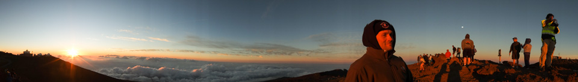
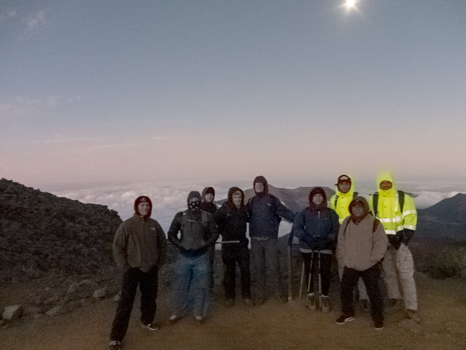
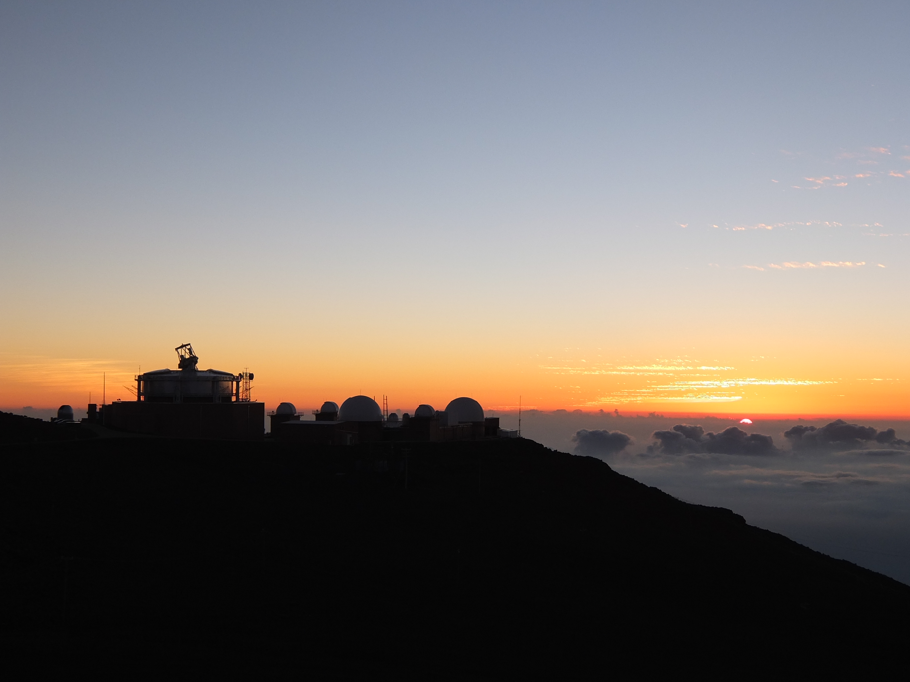
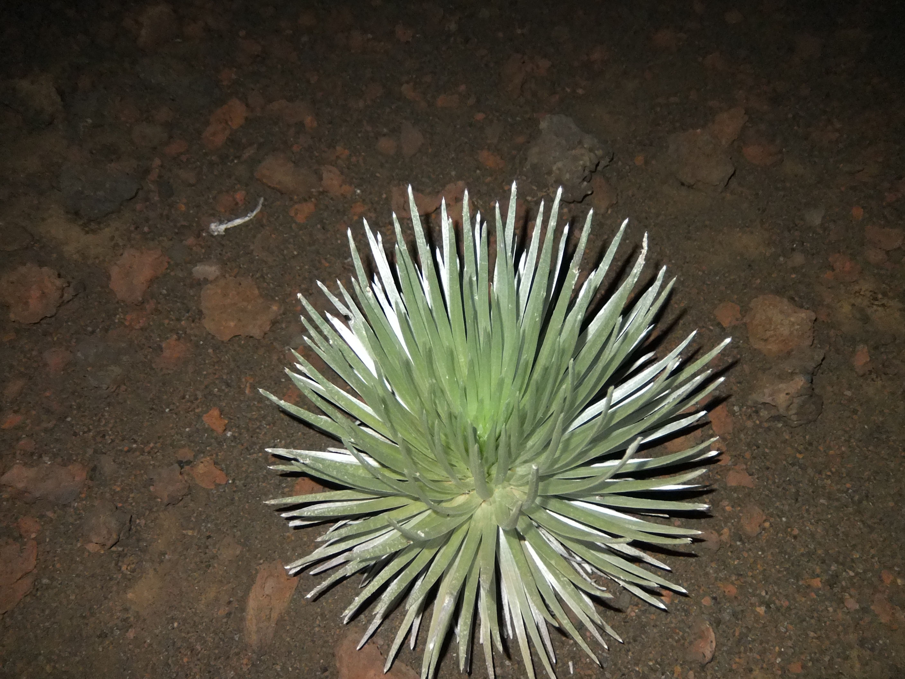

**Hiking by the Light of the Moon**

That's not me in the image, much too young and skinny. No, it's my friend Erik who suggested that we hike Haleakala under some serious moonlight. It was time once again this past weekend for a full moon and one of Erik's favorite things to do is hike the crater in that special light.

Now let's be clear on this, I'm not much of a hiker. It's been years since I've hiked and I've certainly had my reasons. Most recently my hip would not allow me to hike. After I had that replaced in 2014 and lost over 100 lbs. I had fewer excuses, but frankly, I was a little leery of taking it up.

In the past I've also had a number of arthroscopies, three on my right knee, one on my left. Both knees suffer a bit from osteoarthritis so I tend to avoid walking in situations I don't have an alternate mode of transportation available. That isn't to say I don't walk. I do, indeed I try for a couple of miles a day whenever possible, but I like to know I can hop a bus, hail a cab, or ride my bike should it become a problem.

Well that fear has been conquered. And in extreme conditions to boot.

After a long day involved in meetings for a non-profit I volunteer with which were held in Lahaina, I drove a four of my buds up the slopes of Haleakala to meet up with another group coming from a different direction. In all there would be ten of us.

I'm not in that image either. I did take the photo though, with the last bit of light my camera would be able to pick up without a flash for the rest of the evening. I should have taken a better camera for low light work, but live and learn.

So anyway...

It's sunset and we are up at the very top of Haleakala around 10,000 feet up and it's...cold. The wind is blowing and the sun is going down and I'm really grateful I actually had the right sort of clothes to wear. Layer, layer, layer.

After the sunset we head off and down the inside of the crater. There isn't really much to say. That's not because there isn't much there, but because it's so awe inspiring that anything I could say wouldn't come near to describing how captivating, how mystical, and simply how stark, raving, beautiful this place is.

My legs worked find and I was very lucky that a friend was able to lend me his trekking poles. I'm not sure I could have done this hike without them. That's not because the hike is so hard, it's not, but because with my legs I need all the help I can get. They helped. I'm getting a pair for myself.

And it turned out that I wasn't the slowest member of the I group, at least not on the way down, nor was I the fastest. In fact for some time it seemed I was hiking alone. I knew that I wasn't far behind the lead group, nor far ahead of the trailing group, but there I was...alone under the starts. Wow.

My camera wasn't really up to the task of lowlight photography as I've said, but we did pass through a "garden" of Silverswords, a plant found nowhere else. I used my flash.

We joined up again off and on over the route and hiked as far as the start of the crater floor near a hitching post for the horses that make the tour. We ate and drank our fill, rested a bit looking at the sky, and began the hike back up.

It took two hours or so to get down to 7500 feet or so where we stopped; it took three hours in reverse.

The hike back was tough on me. I had plenty of energy and my legs were fine. The problem wasn't my stamina or physical fitness...it was the altitude. We were pretty high up, above that evenings cloud layer for sure and my body decided that one the way up it needed more oxygen. My heart would start racing and I'd have to take break to calm it back down. Luckily I know the signs from all the cycling I do so I wasn't in any danger, but it was a bit disheartening to have to stop every 500 yards. Still it wasn't a bad hike back till the last quarter mile. Then it was...um...well let's just say it wasn't the best part of the trip.

Still I made it, in no small part because of the encouragement of two of the younger folks who hung back with me that last bit. One of them confided that last time she'd done this she was the tail end Charlie. No shame there...hell, I'm proud I did the hike.

And then it was over. Sigh.

I was asked if that was it for me and I said,"I'll say the same thing after the first time I biked across Iowa. Never again." This summer will make my third time across Iowa.

That's my story, I'm sticking to it!

===
