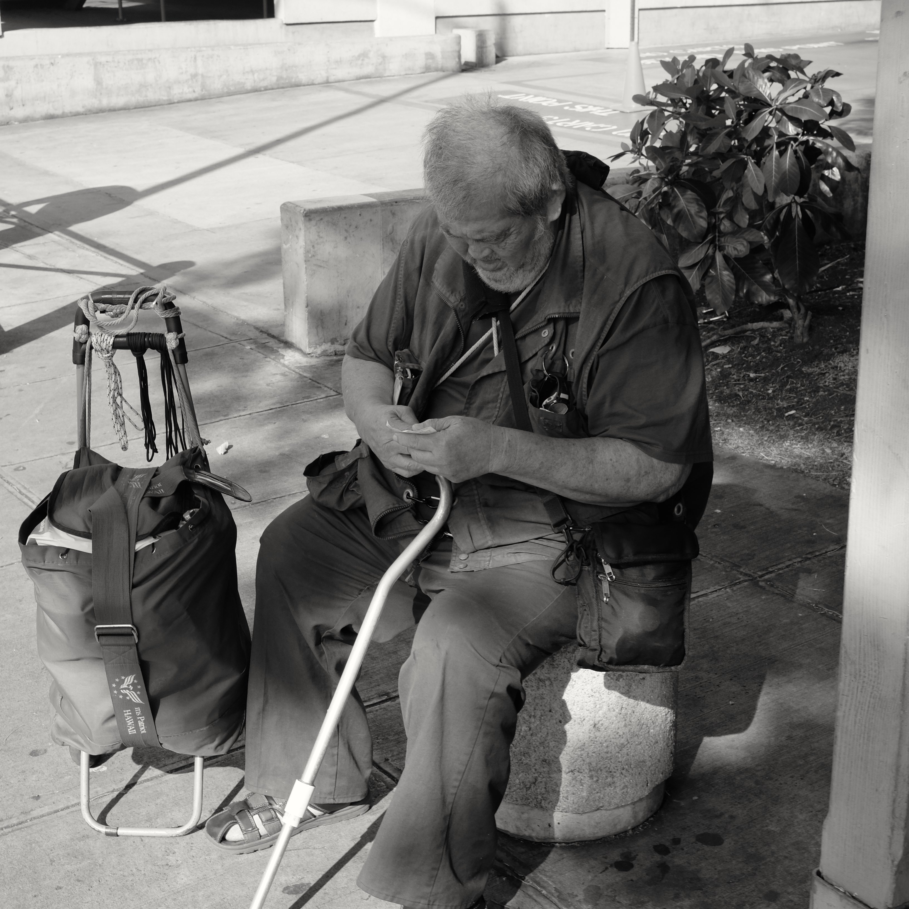
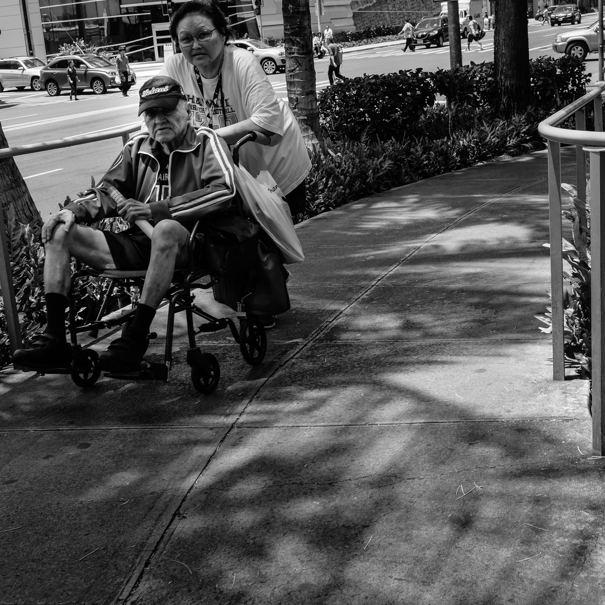
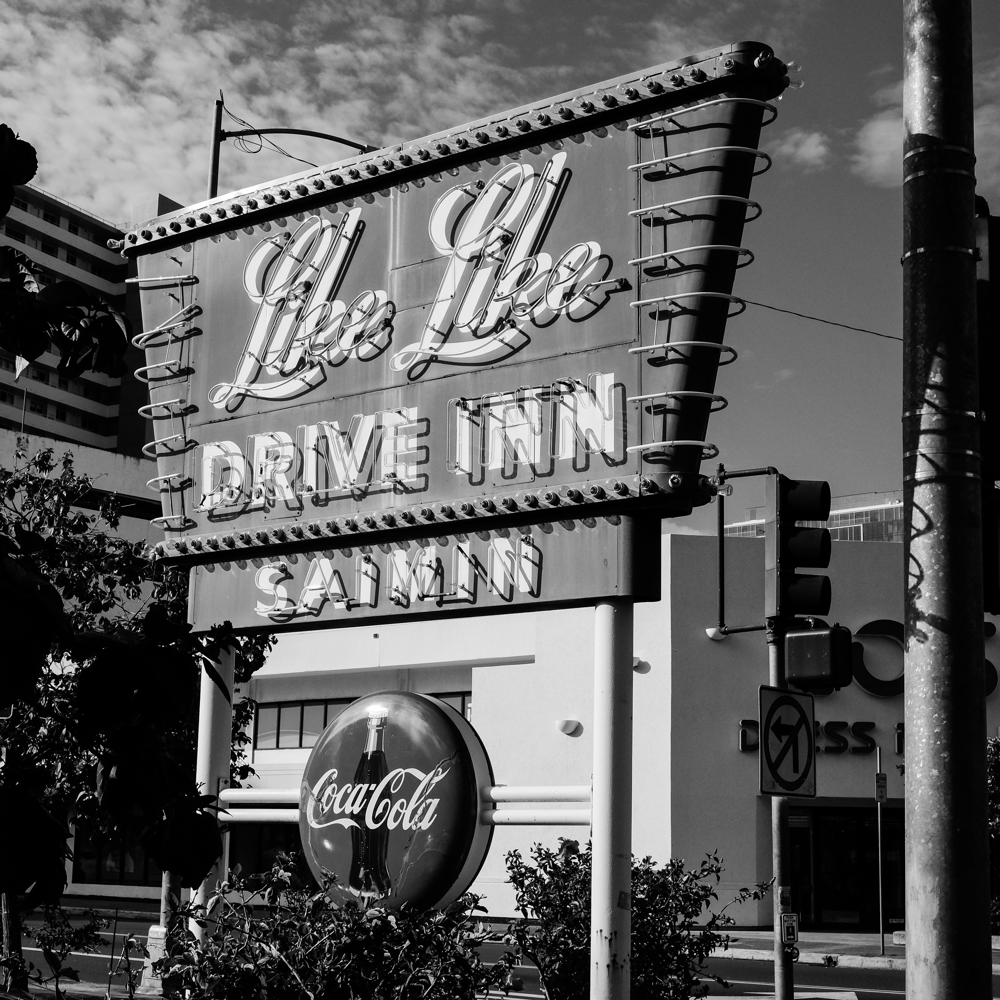

===

**Keeaumoku Street Testing My X-10**

Since I just got a new camera I had to find a place to check it out, besides my auntie's birthday of course. Of course there's never really a need to look too far for interesting subjects. Indeed working on Keeaumoku St. gives me an endless source of street photography subjects.

I've always been fascinated by street photography but, quite honestly, have never felt brave enough to try it. Well that's changing - slowly.

I really love the fact that the X-T10 is so customizable when it comes to creating images. I'm really happy shooting with the XF 27mm F2.8 pancake lens, as well both kit lenses of course. I particularly like shooting in monochrome mode using a 1:1 format.

Currently I'm really just shooting jpegs because this Fuji creates such great ones out of the camera. Yes, RAW is available, but mostly I don't use it. I suppose I will at some point, but frankly, I mostly mess up decent images when I tweak them. There are exceptions, as when I want something special, but mostly, I just want a good image.

By the way, color images look great too - especially if you like saturated ones. Here's our 'garbage gang' at work, showing off our haul (taken with the Velvia look - not super for skin tones, but oh those colors).

But really, at heart, I like B&W!

Aloha!
