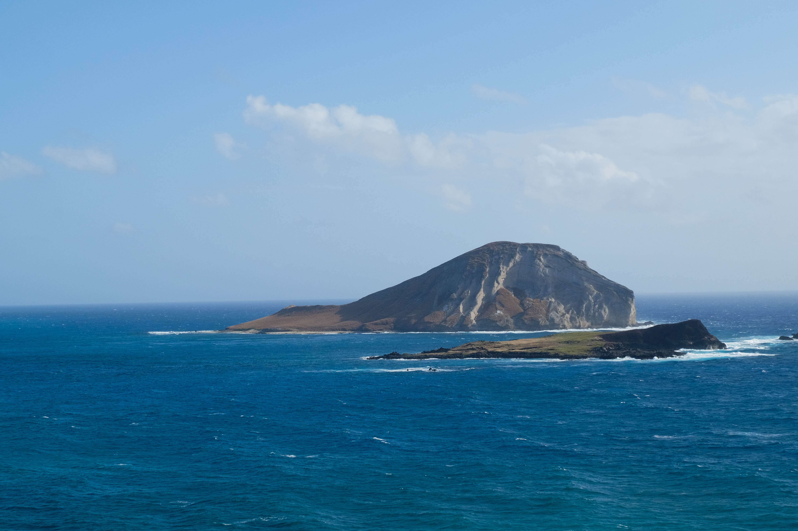
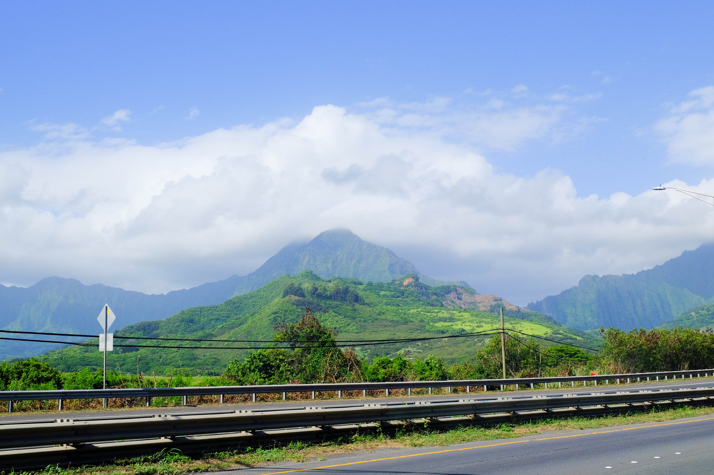
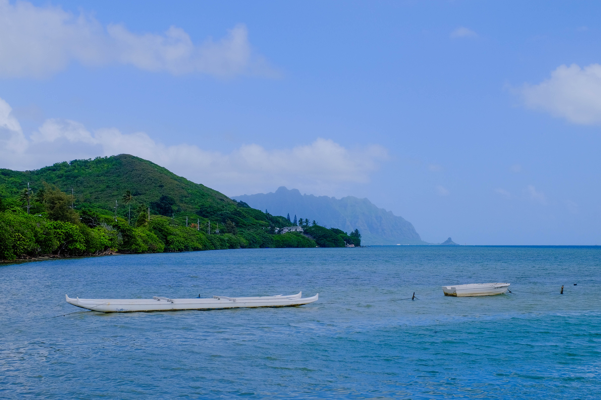
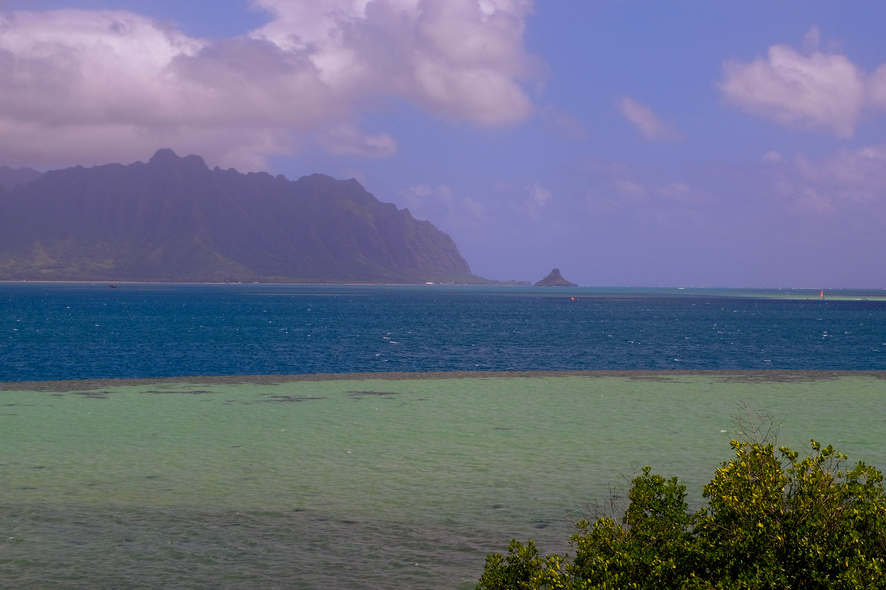
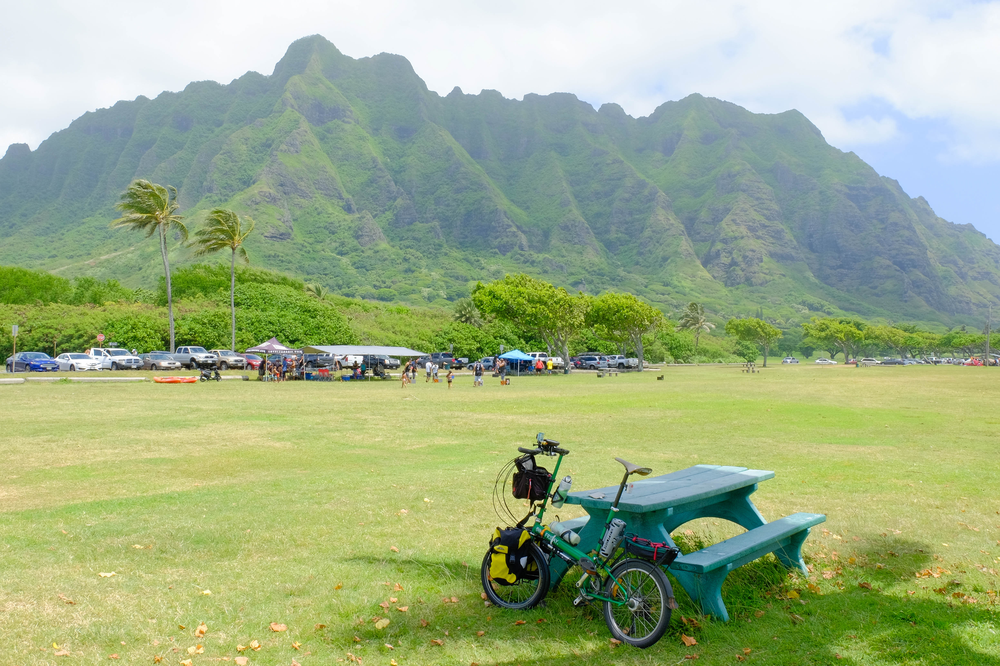
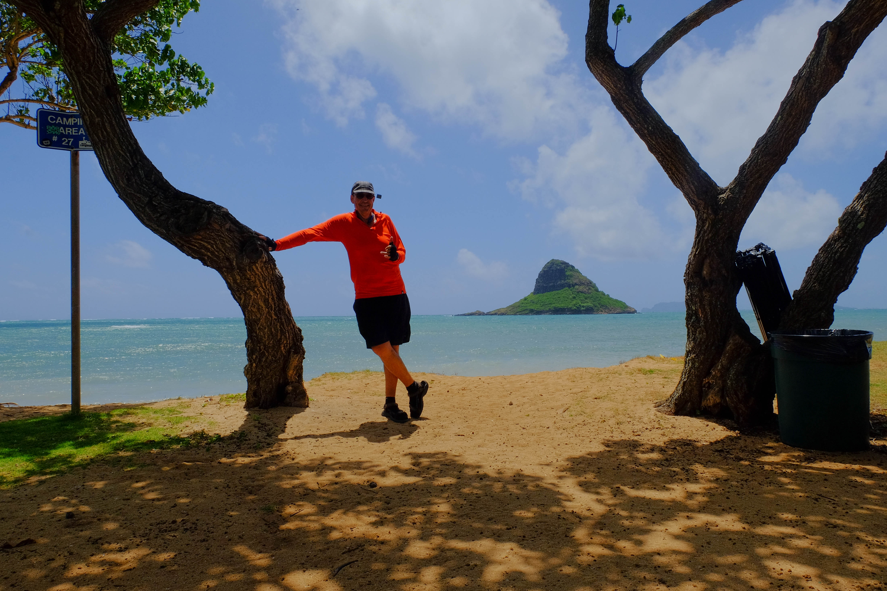
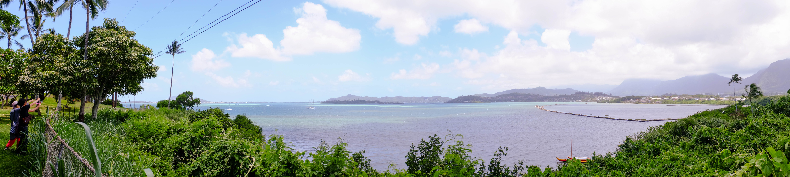

===

**Almost Ninety Miles**

Well I'm down to the final couple of weeks before I leave for RAGBRAI. I've ridden my butt off, almost literally at times. I'm getting close to my target for miles ridden. Yesterday helped me get even closer

I started off thinking I was going to ride to Kualoa (Chinamen's Hat) to join in on a bit of celebration and picnic. Well as it turned out, they were further down the road and...more on that in a bit.

The last couple of days have been windy here on Oahu with warnings and gusts up to 50 MPH. I've been riding my [Bike Friday NWT](https://www.bikefriday.com/folding-bikes/bikes/new-world-tourist/) with panniers and a load to make sure I'm more or less duplicating the conditions I'll have on the mainland. A load both helps and hinders in wind. As I'm bit heavier I'm a little less likely to be blown sideways; as I've got more exposure, I'm a bit more likely - and less aero.

Luckily the wind was quite as bad as predicted, though at times...

I started off around 6 AM and felt great. I didn't have my usual thoughts of "why the heck am I doing this?" They never last long, especially once I'm warmed up and out of Honolulu, but I could be back in bed, eh?

All in all I guess I'm up and out for much the same reason these folks are that time of the morning, as seen from Diamond Head:

Getting out of Honolulu is generally the least pleasant part of the ride, partially because it's urban (more or less), partially because I do it all the time, and partially because of my "why am I doing this" attitude. Yesterday it was just fine - except for the rude roadies who blast by but can't be bothered to call out "on your left." Something's wrong with those guys (not so much the gals - they do tend to call out or at least say hi). Get over it guys...you aren't in the [TDF](http://www.letour.fr/us/). Hell, they are probably nicer to each other. At least when there aren't [fisticuffs](https://www.youtube.com/watch?v=AFvbefsDN00).

I made it Makapu'u lookout with no trouble, though the hill up to it was, um, windy. My buddy Erich claims that's his least favorite hill on the island and I tend to agree - if it's windy. The view was great though!

On I went through Waimanalo.

<iframe width="560" height="315" src="https://www.youtube.com/embed/FugwSV5VOdY" frameborder="0" allowfullscreen></iframe>

After that I took a new route, or rather, once I don't normally ride. In the past I've mostly stuck with riding over to Castle Hospital and then up and down the gulch there.

This time I went through Kailua and over Mokapu Gap into Kaneohe. I really enjoyed this part, but I have to admit that the road isn't as good. It's scenic through, in a way the other route isn't. Glad I did it and I'll probably keep it.

Though ending up in Kaneohe rather than just sort of bypassing it is, um, well it's less than grand. Still the views on the way...yum...

This particular route stays by Kaneoha Bay, down on the water. It's actually the same route used by the [Honolulu Century Ride](https://www.hbl.org/honolulucenturyride/) so I have done it before, once. I should note, it's not the distance that keeps me from that ride, it's the fact that there's just too many people.

One of the nicest bits of the ride is He'eia State Park and the He'eia harbor. Here's a shot from the harbor as I look out towards Kualoa - my goal in the distance...

And as you can see here, I'm getting a little bit closer. I'll note that there was a fair amoun05_Hat.jpgt of [vog](https://en.wikipedia.org/wiki/Vog) in the air yesterday and as I neared the end of my ride I could definitely tell I'd been affected. No huge symptoms, but...well...I'm not 18 anymore I guess.

And then I was at Kualoa! Here's my Friday with the mountans behind me.

This is where things got dicey though. I'd planned on going to Kualoa because I'd though some friends of mine were having a campout there.  I was wrong. It seems they were about 10 miles further up the road. And, of course, if I went that would have added 20 miles to my trip. I'd planned for about 80 miles and wasn't really feeling like a full century.

I could have done it. No doubt. That wasn't the issue. The issue was how I, and probably other's feel, about having to ride further than they'd planned on. I recall hearing about a study on this, using cyclists, when they were told how long they'd ride, then the time was changed on them. Let's just say performance drops. It seems we mentally prepare for a distance or time of X and any changes to it lessen our performance. I'd planned for 80 miles, that's what I wanted to do. So that's what I did.

I'm not completely sorry I missed the picnic. I was mostly going just to have a destination and I'd made my goal. All good.

Before I went back, I did make another image...

The ride back was really just the reverse of the ride out. I used the same route back and am glad I did!

Last year I helped out at He'eia Fishpond, the [Pani ke puka event](http://localhost/gravblog/blog/pani-ka-puka).

Well here's a pano view of the whole thing.

The view at the top of this post is another pano I took on the way back. Honestly the ride back wasn't really notable. I was fine and had plenty of energy when I finished. I even contemplated adding a few miles in town to make 100, but hey, I'd planned for 80, did 89, and was hungry.

Did I mention that because of my current eating habits I did the whole ride on...nothing. That's right, I didn't eat anything after about 9 PM the night before. I did have a big cup of coffee about 35 miles in, drank lots of fluids, and stopped for iced tea on the way back, but solid food or sugars? None.

So yes, I was hungry when I got home. But not famished or bonked.

But speaking of hunger, I'm meeting a friend for lunch in a bit so it's time to get going. Hope you enjoyed my ride as much as I did!

Aloha!
