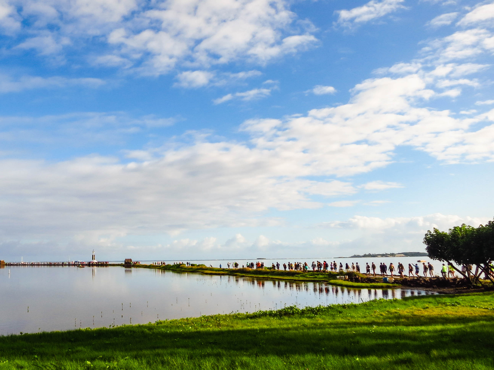
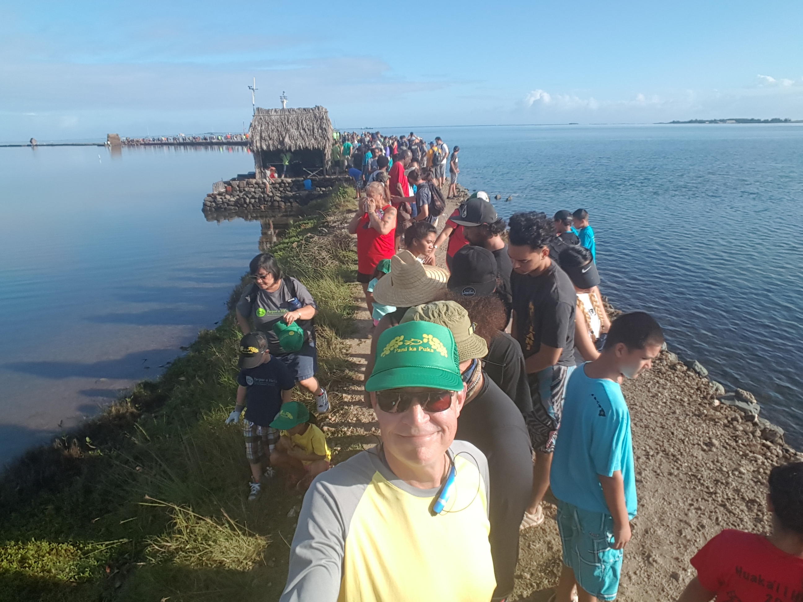
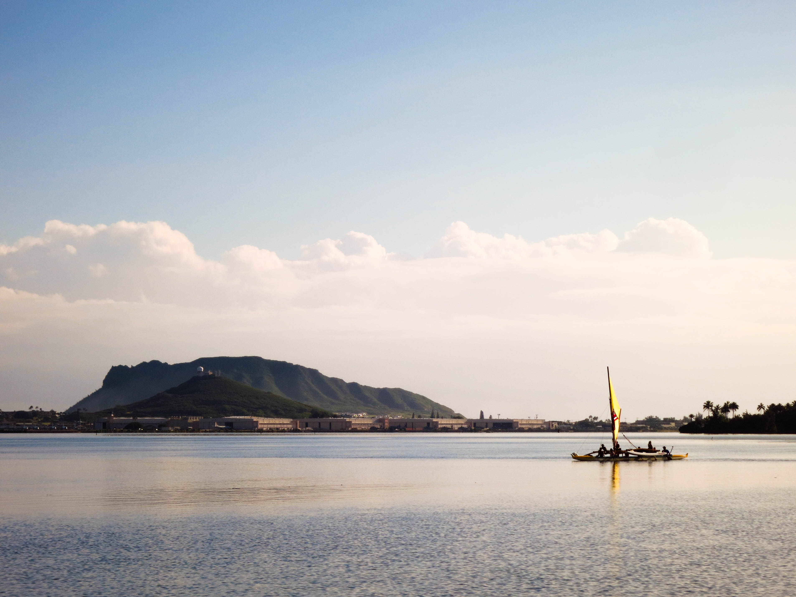

---

**Hauling rock for a good cause.**

===

A friend from work emailed a link to the [Paepae O He'eia](http://paepaeoheeia.org/panikapuka/) site and request for volunteers. 

It seemed like a great way to spend a morning, helping the community, getting a view I might not otherwise get, and a bit of exercise to boot.

It was all of that and more.

The day started early with my buddy Andy picking up myself and a friend from work around 7:30 AM. We needed to be out to Kaneohe early as we couldn't park near the fishpond, but would be bussed in from a nearby shopping center. We were actually quite early, perhaps even too much so, but parking was easy and we hopped on a bus for a five minute ride to the site without much ado.

On arrival we descended a steep driveway the headquarters were quite a few folks were being instructed and then sent off to 'line.'

It had been wet the night before it would seem and, as we walked out on on the path, we had to avoid mud puddles stretching across the path. We all hoped we'd get a dry section of the levee.

Thankfully we did.

Having noted that we were early, I'll also note that because of this, we had some time to wait until the rocks started following. We amused ourselves with chat and pictures.

And then the rocks started moving. A few slow test buckets at first, and then we worked. 

Some buckets were light, some buckets were not. Some of the most unlikely folks on the line did the best. A young lady next to me was indefatigueable; some strong young men needed breaks. I did okay. All the cycling has given me pretty good stamina so I didn't really tire and once I learned the mechanics of taking and passing a bucket it really didn't take a huge effort. The trick is, of course, to let inertia do the work.

Of course other folks were out and about and not helping with the rocks...

