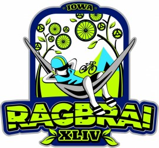

**My Kind of RAGBRAI**

===

I love the smell of [RAGBRAI](http://ragbrai.com) in the morning. It smells like...pigs and corn.

I'm off to [RAGBRAI](http://ragbrai.com) again. This will be my third crack at it and I'll be in the best shape I've been in for any of them. For the last two I was decidedly overweight. I did fine, but basically I was carrying an extra small person around my belly.

This year's attempt is also going to be wrapped up with a trip back, and back in time more or less, to my 40th high school reunion. Wow...40 years. Who knew I'd live this long?

In any case I'll be riding a lot this summer. This means I'm really glad I have a hammock because it looks like I'll get some use out of it. You can see that simply by looking at this year's RAGBRAI logo:

I'll have more on this later. Till then you should note that the route for this year's ride hasn't been announced yet. That'll happen on January 23rd if I'm not mistaken. Once that happens I can plan my route to Shorewood!

Aloha!
