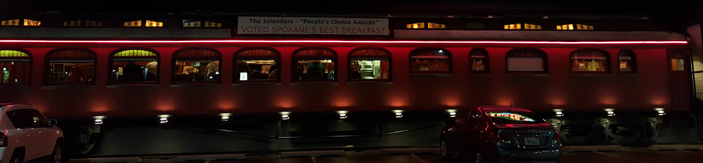

**Eating my way through Spokane**

===
The jokes starts, "So I was in Spokane the other day..." Actually as far as I know there is no joke that starts that way, but I was in Spokane the other day.

I'd been in Spokane at least once when I was much younger. My maternal Granddad had a place in Western Montana and we used to travel there in the summers when I was teen. We often needed to do some shopping for stuff you couldn't get locally or couldn't get cheaply locally. Keep in mind this was a time before big box stores and cheap imports as we have now. So off to Spokane we went. I don't remember a thing about it I'm afraid.

And, true to form, it hasn't changed.

Well that's not exactly true. You can see what must be "old Spokane" pretty easily. Mostly centered about broad western streets and the like. Of course there are plenty of new buildings, both good ones and ones that, well, could be anywhere and not dress it up. Still that's true in Honolulu as well.

I arrived on a Wednesday evening and frankly I was too beat to do much other than finish off the snacks I'd brought with me so that doesn't really count as eating my way through anything. But eat I did the rest of the time I was there until I left the following Monday morning.

First up was Frankie Doodle's. Yep, that's the name.

It's a diner where one of the waitresses confided to me that, "Dear, I've been working here going on 29 years now." Yes, it's that kind of place. I'd love to tell you everything on the menu is great but frankly (bad pun) I had the same thing every day. An omelet. But not just an omelet. They announce boldly they have huge omelets and, well let's just say they are kidding. They also managed to get my first stab at one cooked just the way I like it so I came back every day and am glad I did. I brought some friends along one day and among the things they tried was "crunchy french toast" (at least I think that's it) which was made with corn flakes in the batter. She loved it.

Next up on the fun places to eat was [The Onion Bar & Grill (Downtown)](http://theonion.biz). This place with an old-timey feel, good burgers, and great service. I bring up the last bit because I had a group of about 15 people with me on the Saturday we had lunch there, we weren't the only big party, and they did great.

And finally, the coolest place of all, [Frank's Diner](http://franksdiners.com). It was my last night in Spokane and I'd been busy hitting the museum, seeing friends, and pretty much taking in my last evening when hunger struck as it is want to to do. Hitting up Google Maps I found that there was a railroad car diner near me and if I hurried I might just make it. Glad I did...

I got a seat at the counter and was promptlly and pleasantly greeted. Plenty of time I was told so I took the opportunity to look around. This place is georgeous. If you get a chance, drop by. They aren't open late so plan accordingly.

There were plenty of other great things about Spokane and perhaps I'll get to them, but this morning I'm most impressed by how much I ate, how much fun it was eating in Spokane, and how much I think you'll enjoy the same should you find yourself there with a hunger pang or two.
