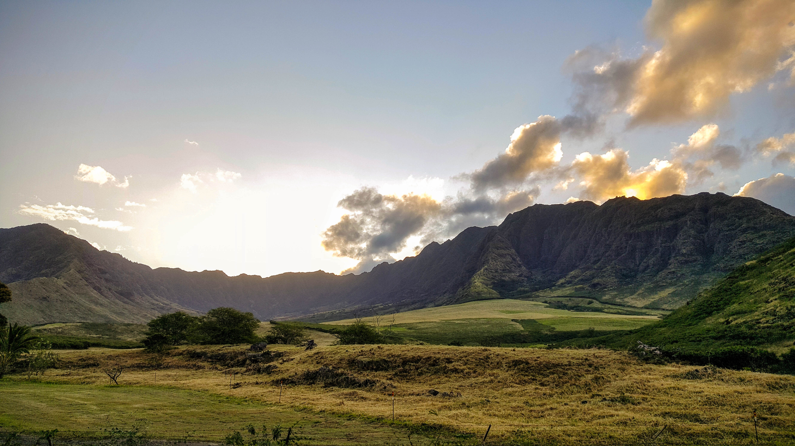
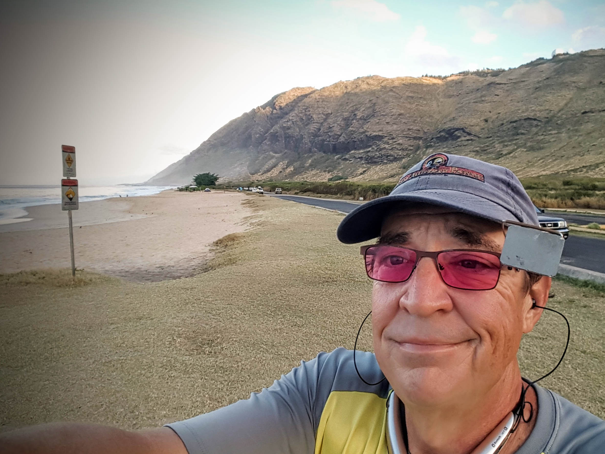

**Sunrise at Makua Valley and More!**

President's Day afforded me a day off of work with no other obligations and I took full advantage of the opportunity. It'd been a while since I'd ridden on the West Side of Oahu and this seemed like a great opportunity.

Last time I did this my friend Erich was in town and we had a great time, though as I recall I did have a flat in Kapolei. We rode, saw the sites, got some pictures, ate a bit, and pretty much filled up the day.

This time I was going solo but the route remained the same. Indeed there's really only one road so...

I boarded the County C bus around 5:20 AM, tied my bike in to the bike rack - this is very important; I've had trouble in the past with damages. Off we went.

At this time of year it stay's dark fairly late into the morning. By late I mean almost 7 AM. That's about the time we got Makaha Beach Park, the last stop for the County C. Truly there's not much more past it in terms of major habitation, mostly the controversial Makua Valley Army Base. I won't get into why, let's just say live ordinance and native species and religious sites don't mix.

It's a beautiful place though.

I rode out the end of the road, the paved road that is. You can ride around Kaena Point, or at least mostly with just a bit of portage. That wasn't the plan though. I was headed home the short way, 50 miles short, but shorter than around the point. Good thing too as I'll explain.

Here I am out near the end of the road. I've been told not to hurry to the end of my road, so I stopped short, for now at least.

Then I headed back to town.

As I've lost weight and adjusted my diet I've found a number of interesting changes to my ability. First and foremost, this is all a lot easier. At my heaviest I was about 305 lbs. Today I'm somewhere between 185 and 190, depending. You can imagine how much easier I am to haul around.

The other change I've noticed is that now that I'm on a very low carb diet I don't get hungry or "bonk" on rides, at least not up to 50 miles or so. Actually longer is fine too, but I do get hungry.

On this ride I pretty much went non-stop for 50 miles without having had anything to eat in the morning. I even skipped my morning coffee. I was on a bus for over an hour, riding for 4+ hours, and only hydrated.

The ride was a little slower than I might have managed on another day as I was pretty much headed into the wind the entire way. It wasn't super strong all the time, but it was noticeable. I was also a little nervous because the bike path median along Farrington Hwy. is pretty much gone in most places and, being honest here, on the West Side folks pass a little closer than they do on the Windward side and North Shore. Don't know why and it's totally anecdotal, but that's my experience. Keep in mind I didn't get hit or even have a close call so it was fine, it just kept me a little more on edge than I prefer.

Overall the ride was great. I did think about stopping for coffee, but just kept at it and, before noon I was home. Sweet!

Now about that, 'lucky I did' bit. Once again I seem to have worn out my bottom just a bit. I think it may be the saddle I'm using so I'm going to see about riding 50 miles in a couple of weeks on a somewhat more forgiven saddle. This doesn't bode well for Iowa and Wisconsin, and frankly when my bottom was bigger I never had this trouble. Now, without so much padding, hmmm...

Well there you go.

===
