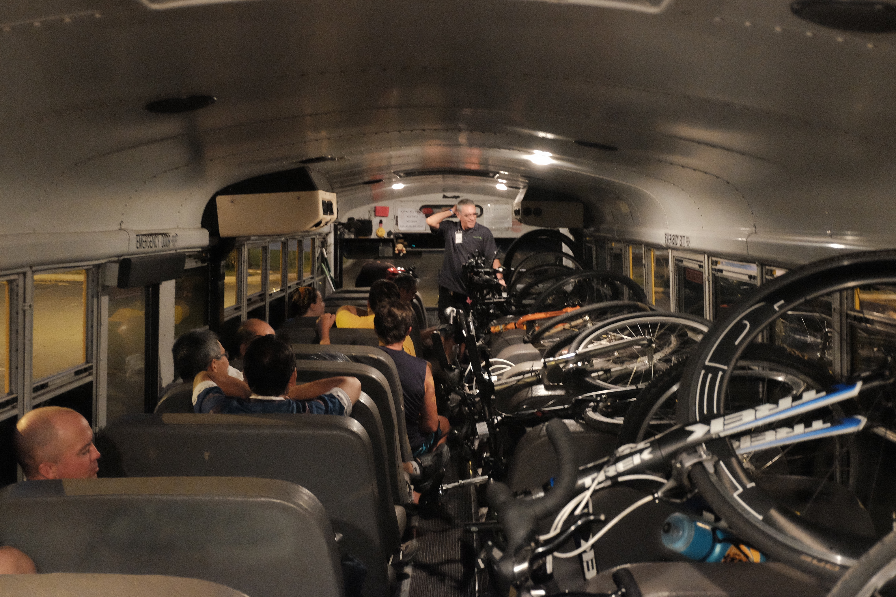
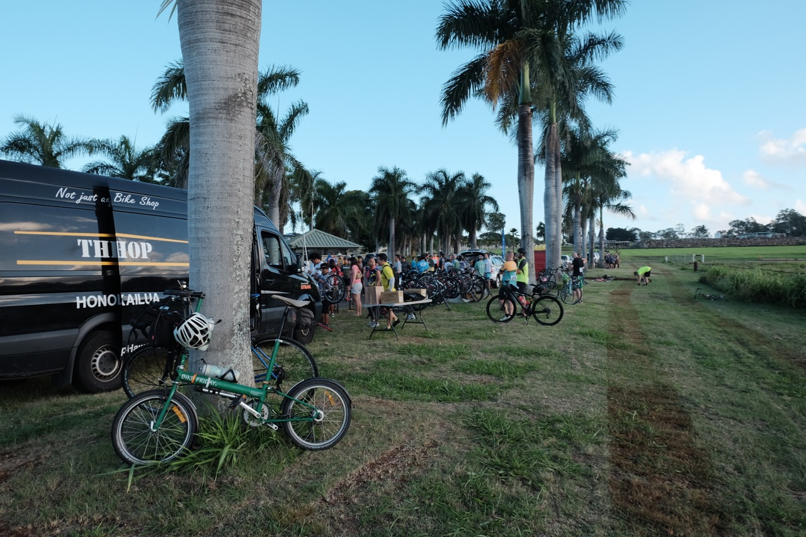
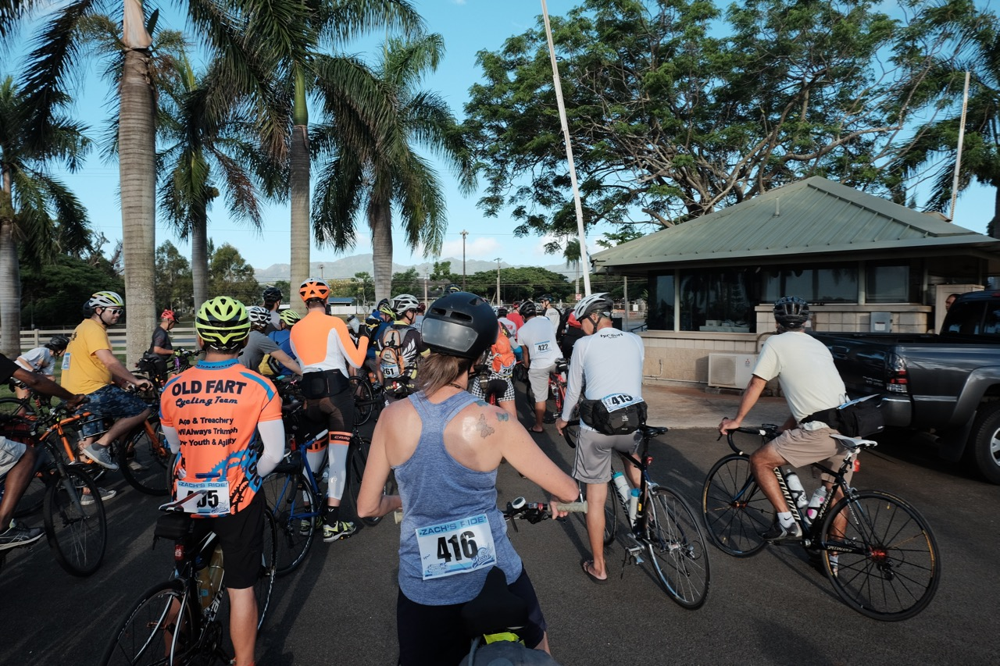
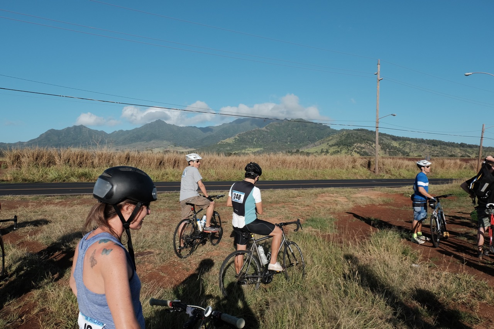
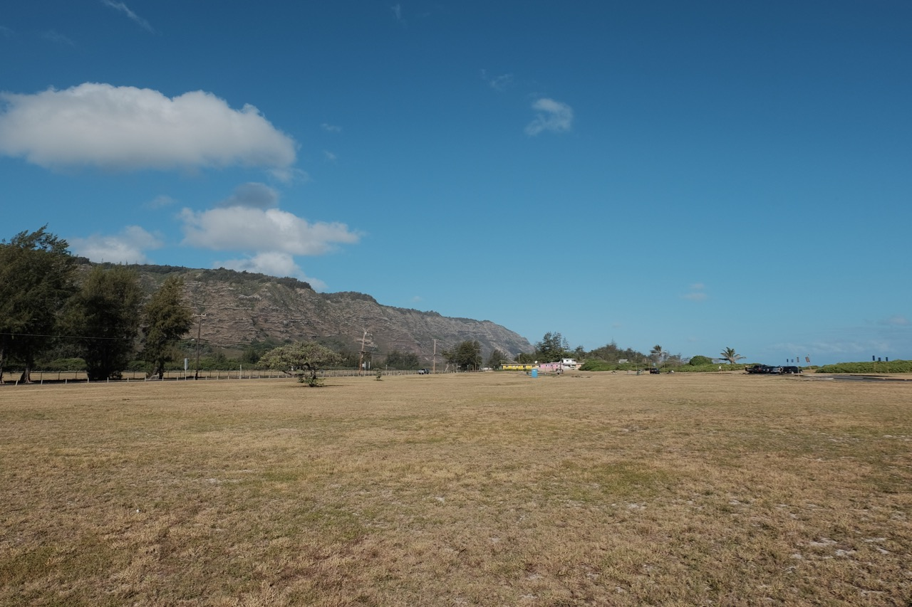
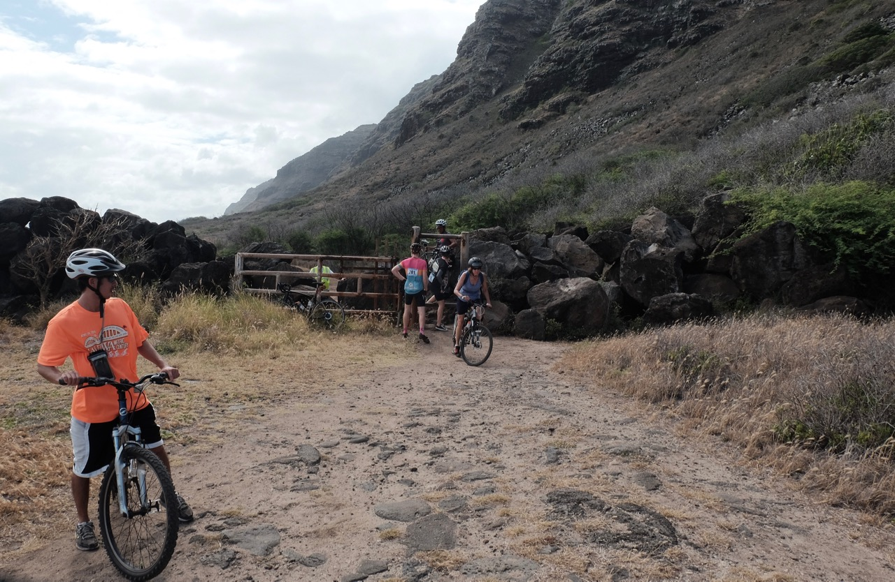
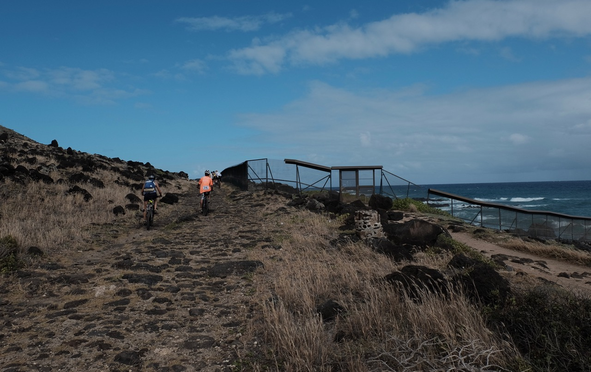
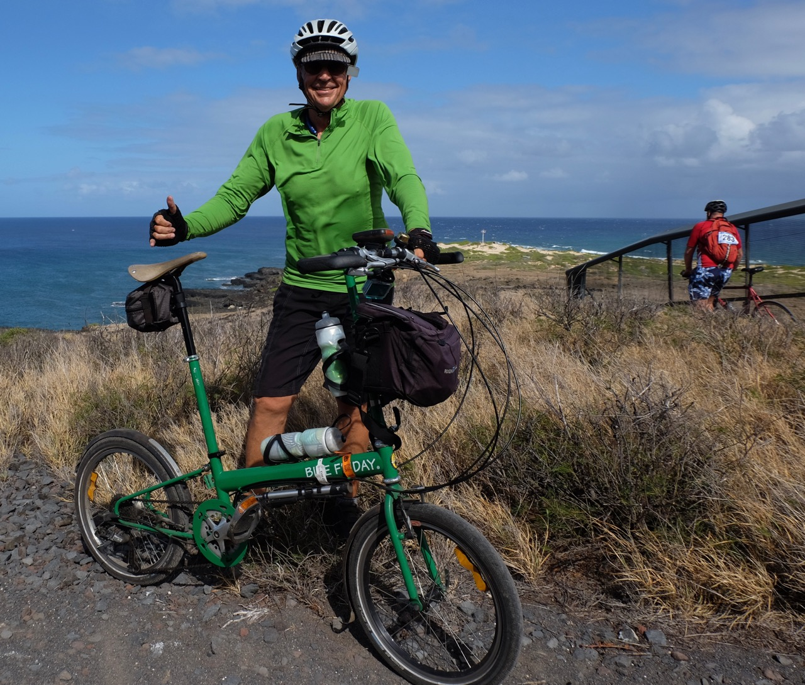
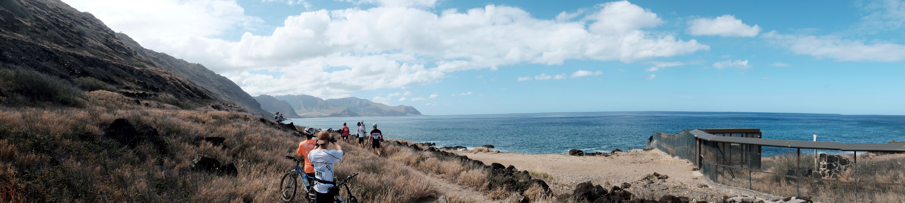

**Zachary Manago's Ride in Paradise**

This was my first 'Ride in Paradise,' an annual event held in memory of Zachary Manago, a young man needlessly killed on our roads while riding. You can find out more about Zach and the ride on the [Hawaii Bicycling League's website](https://www.hbl.org/events/zachsride/).

Here in Hawaii we do grieve over our lost one's, but we also celebrate their lives and that's what this ride felt like. I real celebration. Before I go into the details of my ride, here's the route.

<iframe src="https://www.google.com/maps/d/embed?mid=1eLhin8eYnQAGT6VJtekordjRcPc" width="640" height="480"></iframe>

The ride started in Kaka'ako. I know it doesn't show that on the map, but I showed up at 5:00 AM to get on a Robert's yellow bus (just like I had way back when in elementary school only newer) and we headed to Wahiawa, the official start.

I was on a bus like this with bikes for the [JBK Haleiwa Metric Century](https://www.hbl.org/haleiwametriccentury/) last year (didn't make it this year, Dad's B-day) and it seems everyone had their loading-fu working as it was a snap this time - not so much last year. The only problem with the ride was me - and the fact I probably shouldn't have had such a large cup of coffee. Mucho mahalos to the fella who let me in line ahead of him. Thanks dude. You're my hero.

So as you might have guessed I was off the bus - in Wahiawa...ready for a long downhill into Wailua. Of course we did have a few minutes of instructions, reminding us to be nice to each other and, no matter what we did not to go faster than the lead vehicle. I did not. As you can see, I rested my bike for the ride while I listened to the instructions...wait, how did I take that picture if I was over listening to...um...never mind.

And then were were off, lining up in a pack first. I was near the front and, oddly for me, stayed that way for the entire ride. Keep in mind it wasn't a race. Were it one I would not have been up front, at least not for long.

We headed out and did a wee bit of up and down, crossing the bridge outside Wahiawa as we headed towards our big downhill. We were asked to hold off on the hill till we'd all gathered so we could all go at once and not hold up traffic behind us too much. Must have worked, we all made it.

By the way, #416, the young woman in front of me was a strong rider who, if I'm not mistaken, had done a RAGBRAI. We chatted for quite some time as we headed to Mokuleia, and other places along the way. Perhaps I'll see her on the road again sometime.

The road downhill was newly paved and, well the only word for it was sweet. Real sweet. We kept on as we passed the polo field, the skydiving airstrip, and ended up out at Mokuleia where we stopped for a break. It's lovely out that way, if a little empty (not people, greenery).

Once again we headed out and this is where the interesting part of the ride started. Okay, I'll be honest, it was the most interesting to me as I'd never done this before. From Wahiawa to Mokuleia was all new on a bike, though I'd come out here before in years past. But heading out on the trail to Ka'ena Point - nope, all new.

While it would be possible to take the bike through yourself I'm real happy folks were willing to help lift the bikes through the gap so we could ride off to the ends of Oahu. Literally. You can see the condition of the trail. It was rock, rocks, a bit of sand, and rocks. There were parts that were unrideable, though in fact most of it is rideable, provided you go slow and pick a good line.

In this image you get another view of that trail -  good fun. I was just fine on it. I only had one scary moment and it wasn't rocks, it was sand. I kept to my pedals though and didn't fall, just sort of wobbled before I gained enough traction to move on. You can also see the 'rat fence' which is used to keep pesky predators away from the bird sanctuary that is Ka'ena Point. We had a permit for this group and we were told it stated in no uncertain terms that we were not to touch the fence or walk on the cement into which it was sunk.

Then we were at the point, now we'd be heading south instead of north. I got someone to take my picture. You can see the actual point in the distance behind me. I'd lose my top water bottle somewhere along the path and discover it a bit later at the Yokohama rest stop. That's not Yokohama in Japan. It's our own.

You can see a lot of the west side in this next image (the same as that at the top of this post).

===
